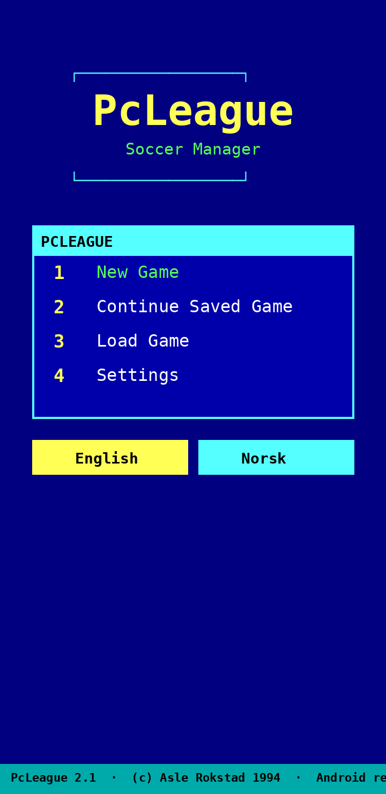
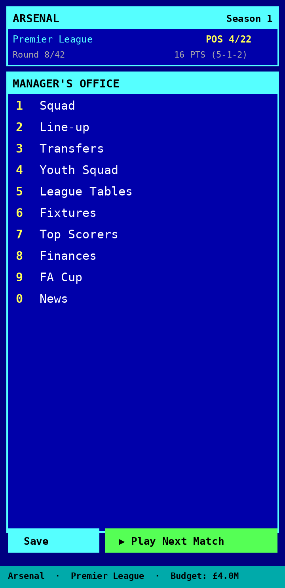
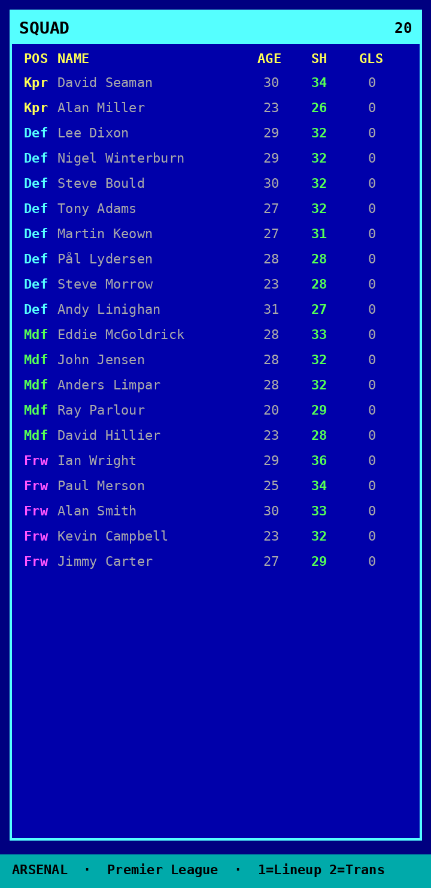
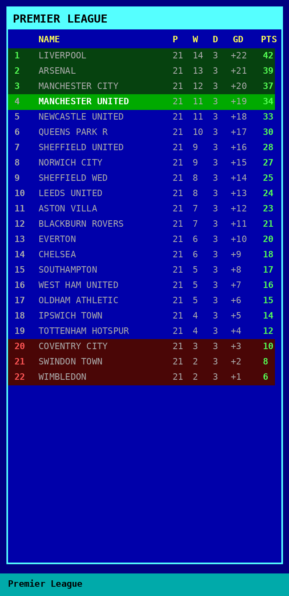

# PcLeague

A faithful Android recreation of **PcLeague 2.1**, the 1994 DOS soccer-manager
game by **Asle Rokstad** (PcLeague SoftWare). It carries the **complete original
database**, decoded byte-for-byte from the game's `RESOURCE.*` files: **92 clubs
across 4 divisions and 1733 real players**, with the original retro DOS look.
**No ads, no IAP, no analytics, no tracking. Fully offline.**

<p align="center">
  
  
  
</p>
<p align="center">
  
</p>

## Install on Android

**Direct APK download:**
https://github.com/Matswm86/pcleague/releases/download/latest/pcleague.apk

1. Open that link in your phone's browser and tap to download.
2. When you tap the downloaded file, Android may say *"For your security, your
   phone is not allowed to install unknown apps from this source."* Tap
   **Settings**, toggle **Allow from this source**, then go back and install.
3. The app appears as **PcLeague**.

> The APK is **debug-signed** with a stable key, so reinstalling a newer build
> over an older one Just Works — no uninstall needed. Versioned downloads are
> also on the [Releases page](https://github.com/Matswm86/pcleague/releases).

## The game

Pick any of the 92 clubs and manage it through the seasons, exactly as in the
1994 original:

- **Real 1993-94 database** — every club and player from the original game
  (Seaman, Cantona, Schmeichel, Wright…), with the original ages, positions and
  shape ratings.
- **4 divisions** (Premier, Division 1-3) with promotion and relegation.
- **Squad & line-up** editor with defensive / normal / attacking tactics.
- **Transfers** — buy and sell, with transfer-listed (`T`) players on the market;
  rival clubs trade too.
- **16-player youth squad** — promote a youngster and a new one is generated.
- **League tables, fixtures, top-scorer lists** for every division.
- **Finances** — gate and TV income that rise with form, a wage bill, and the
  classic *sell-to-survive* squeeze.
- **FA Cup** knockout across all 92 clubs, with TV money each round.
- **Match engine** faithful to the manual: player shape curves by age, team form,
  probabilistic results, injuries, bookings, sendings-off, hit-the-post and
  referee mistakes, and 1-10 player ratings with the original per-division floors.
- **English / Norsk** toggle, retro EGA/VGA palette, 4 save slots + autosave.

## How it was rebuilt

The original stores its data in Borland/Turbo-Pascal binary `RESOURCE.*` files.
Everything was reverse-engineered from a personal copy of `PcLeague.zip`; the
decoders live in [`tools/`](tools/):

| File | Contents | Format |
|------|----------|--------|
| `RESOURCE.001` | 92 team names + division & table position | `[4B BE len][name][stats…]`, with a `3a [global#] [divPos]` marker; divPos resets each tier |
| `RESOURCE.008` | 1840 first-team players (20 / club) | fixed 76-byte record: name(16) + nationality(`0x14`) + position(`0x17`) + 52-byte stat block |
| `RESOURCE.017` | 760 reserve/extra players | same 76-byte record |
| `RESOURCE.006` | English + Norwegian UI strings | 71-byte slots, alternating NO/EN |

Player stat block (validated against the known 1993-94 squads): `+2` age,
`+6` transfer value, `+11..14` four shape components whose sum is the manual's
"SUM SHAPE NOW". Position bytes are **Norwegian**: `K` keeper, `F` forsvar
(defence), `M` midt (midfield), `A` angrep (attack). Average skill descends
cleanly by tier (Premier 30.1 → Division 3 24.6), and the marquee names check out
(Schmeichel 36, Steve Bruce 34) — confirming the decode.

> The original program binaries (`PCLEAGUE.EXE`, the `RESOURCE.*` files) are
> **not** redistributed here. This repo contains only the new Android code, the
> extraction tools, and the derived dataset (`data/pcleague.json`).

## Build from source

```bash
JAVA_HOME=~/.jdks/temurin-17 ./gradlew :app:assembleDebug
# APK -> app/build/outputs/apk/debug/app-debug.apk
```

Regenerate the dataset from the original files (needs `PcLeague.zip` extracted
into `_extracted/`):

```bash
python3 tools/build_dataset.py        # -> data/pcleague.json
```

## Credits

Original game © **Asle Rokstad**, PcLeague SoftWare, 1994. This is a personal,
non-commercial recreation made to play the game on a phone. All footballer and
club names are factual data from the original.
